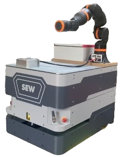

# sew_agv_drivers

## Table of Contents
1. [Repo Structure and ROS2 Packages](#structure)
2. [Usage of containerized environments with Docker](#docker)
3. [Provided ROS2 Packages](#ros2packages)
4. [How to use](#howto)
5. [Useful sources](#sources)

<a name="structure"/>

## Repo Structure and ROS2 Packages

 

This is a core breakdown of the official documentation to the FE-Project of Hannes Bornamann, Mathias Fuhrer, and Robin Wolf at the Hochschule Karlsruhe (SS24). The main repo with the project documentation can be found [here](https://github.com/mathias31415/igus_rebel_on_sew_agv).

This Repo contains ROS2 code to control a SEW AGV. The communication to the AGV is based on this [repo](https://github.com/elekTom/ros_sew_agv) by Tom Schneider. For easy commissioning, everything is set up in a Docker container. The AGV can be operated via a PC either using keyboard keys or a connected Xbox controller.

<a name="docker"/>

## Usage of containerized environments with Docker
### Introduction:
The usage of Docker is a common practice when working with ROS2. The biggest advantage of developing a ROS2 ecosystem inside a containerized environment is that it can be used independently of the host hardware.
Everyone who wants to use this repo just needs to clone the repo from GitHub to the local disk and run the Dockerfile. No ROS2 installation on the host machine is necessary!
All needed ROS2 Packages are installed and set up by default when running the Dockerfile. Moreover, the network setup for the ROS2 Node communication over topics with fast-RTPS defined in the dds_profile.xml is done automatically.

To use the provided Dockerfile, the following prerequisites are required on your host machine:

- Ubuntu 22.04 (NOT in a Virtual Machine!) https://ubuntu.com/tutorials/install-ubuntu-desktop#1-overview
- Working installation of Docker Engine https://docs.docker.com/engine/install/ubuntu/

### Preparations:
We use a Raspberry Pi 5 with 8GB RAM and installed Ubuntu 24.04 on it using the [Raspberry Pi Imager](https://www.raspberrypi.com/software/).
On Ubuntu, we then installed docker according to this [tutorial](https://docs.docker.com/engine/install/ubuntu/). We also recommend installing Terminator `sudo apt install terminator`.

Depending on whether you want to use the software on your PC (with amd64 processor) or on a Raspberry Pi (with arm64 processor), you have to change the base image in the `Dockerfile` file by commenting/uncommenting the following lines:
```shell
# For PC with amd64: (https://hub.docker.com/r/osrf/ros/tags?page=1&page_size=&name=&ordering=?)
FROM osrf/ros:$ROS_DISTRO-desktop AS base

# For RaspberryPi with arm64: (https://hub.docker.com/r/arm64v8/ros/tags)
FROM arm64v8/ros:$ROS_DISTRO AS base
```


<a name="ros2packages"/>

## Provided ROS2-Packages
### [sew_agv_description](https://github.com/RobinWolf/sew_maxo_mts_ros2/tree/dev/src/sew_agv_description)
The description package provides the full kinematic definition and CAD data of the sew-maxo-mts AGV. In ROS2 the kinematics of the robot/agv are defined in a URDF model. The URDF model can be structred by using the xacro package and define sub-macros which are all put together in the main URDF.
Moreover some tags regarding the hardware-communication with ROS2-Control and some tags regarding the Gazebo simulation to simulate sensors like lidar and depth camera are specified in these packages too. The Gazebo stuff is not used in this repository. We use the identical package for our Gazebo simulation in our [sew_maxo_mts_and_igus_rebel](https://github.com/RobinWolf/sew_maxo_mts_and_igus_rebel) repository.

### [sew_agv_drivers](https://github.com/RobinWolf/sew_maxo_mts_ros2/tree/dev/src/sew_agv_drivers)
This ROS 2 driver package is responsible for hardware communication with the AGV (Automated Guided Vehicle). The package uses the ROS 2 diffdrive controller to manage the movement commands.
- **Movement Data Transmission:** The package sends movement data, including x and y direction, speed, and speed mode, to the AGV via a network cable using the UDP protocol.
- **Status Data Retrieval:** It reads status data from the AGV to monitor its current state.
- **Workaround for Motor Control:** Since the motors are not directly controlled, but instead, the AGV needs to receive movement data in the x (rotation) and y (forward) directions, a workaround has been implemented. The wheel speeds from the hardware interface are recalculated into speeds in the x (rotation) and y (forward) directions, and then transmitted to the AGV.

### [sew_agv_navigation](https://github.com/RobinWolf/sew_maxo_mts_ros2/tree/dev/src/sew_agv_navigation)
This package handles connection to a xBox One controller or the PCs keyboaed which can be used to drive the AGV manually and provides all necessary nodes to navigate the AGV autonomously in a recorded map with the use of ROS2 Nav2 Stack. Functionalities for 2D SLAM-Mapping are included too. However, since we are not currently using any of the AGV's laser scanners, autonomous navigation only works in simulation in our [sew_maxo_mts_and_igus_rebel](https://github.com/RobinWolf/sew_maxo_mts_and_igus_rebel) repository.


<a name="howto"/>

## How to use
### AGV Hardware:

 

#### Start the AGV:
1. pull the emergency-stop
2. turn on the AGV by pressing and holding the green and blue button for a few seconds
3. The display is now turning on and the green button is lit up.

#### Turn off the AGV
1. push the emergency-stop
2. turn of the AGV by pressing and holding the green and blue button for a few seconds
3. The display turns off and the buttons stop lighting up.


### Setup connection to AGV:
Before the PC/Raspberry Pi can communicate with the AGV, a static IP address must be assigned to the Ethernet port. This can be done either manually in the terminal or integrated into the autostart.

#### By Hand:
```
sudo ip addr add 192.168.10.222/24 dev enx9cebe8ea463d
sudo ip addr show enx9cebe8ea463d
```

Here `enx9cebe8ea463d` is the Ethernet interface connected to your network. To find out type: `ip addr show`. Something like this shows up:
```
4: enx9cebe8ea463d: <BROADCAST,MULTICAST,UP,LOWER_UP> mtu 1500 qdisc fq_codel state UP group default qlen 1000
    link/ether 9c:eb:e8:ea:46:3d brd ff:ff:ff:ff:ff:ff
```

On RaspberryPi it is `eth0` instead of something like `enx9cebe8ea463d`
```
sudo ip addr add 192.168.10.222/24 dev eth0
sudo ip addr show eth0
```
#### In autostart
TODO Robin


### Launch hardware interface
If you use the `run_dev.sh` file to start the docker container, you have to build, source and launch the launchfile by hand. This is advantageous during development.
```bash
./run_dev.sh

# inside the docker container:
colcon build
source install/setup.bash
ros2 launch sew_agv_drivers launch_agv.launch.py 
```
You can launch this with several different launch parameters. To show them and their default values, type `--show-args`
```
ros2 launch sew_agv_drivers launch_agv.launch.py --show-args
```

If you use the `build_docker.sh` and `start_docker.sh` files to start the docker container, everything needed is build and launched automaticly.
```bash
./build_docker.sh
./start_docker.sh
```

<a name="sources"/>

## Useful sources
- ROS2 control: https://control.ros.org/humble/doc/ros2_control/doc/index.html 
- ROS2 diffdrive controller: https://control.ros.org/humble/doc/ros2_controllers/diff_drive_controller/doc/userdoc.html
- Diffdrive Repo by ArticulatedRobotics: https://github.com/joshnewans/diffdrive_arduino/tree/humble 


